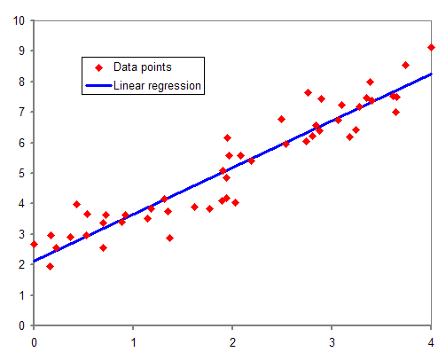

<div class="absolute inset-0 bg-gradient-to-br from-[#0a2e1a] via-[#0d3d1f] to-[#071a10]" />

<div class="relative z-10 flex flex-col h-full justify-center pl-16">

<div class="text-[#4ade80] text-sm font-mono tracking-widest uppercase mb-4">IoT at VGU · Digital Agriculture</div>

# <span class="text-white font-bold leading-tight">Soil Moisture</span><br><span class="text-[#4ade80]">Detection System</span>

<div class="mt-4 text-gray-300 text-lg max-w-lg">
From raw sensor readings to calibrated soil data — sensors, protocols & machine learning on ESP32.
</div>

<div class="mt-8 flex gap-3 text-sm text-gray-400">
  <span class="bg-[#1a4d2a] px-3 py-1 rounded-full border border-[#2d7a40]">🌱 Soil Science</span>
  <span class="bg-[#1a4d2a] px-3 py-1 rounded-full border border-[#2d7a40]">🔌 Sensors & Protocols</span>
  <span class="bg-[#1a4d2a] px-3 py-1 rounded-full border border-[#2d7a40]">📊 Calibration</span>
</div>

</div>


<!--
Welcome. Today we bridge the gap between raw sensor data and real-world meaning.
We'll look at sensors, protocols, calibration, and how to build a soil moisture pipeline on ESP32.
-->

---
layout: center
class: text-center
---

<div class="absolute inset-0 bg-[#071810]" />

<div class="relative z-10">

## Part 1

# <span class="text-[#4ade80]">Soil Moisture Project</span>

<div class="text-gray-400 mt-3">What is it and why does it matter?</div>

</div>

---

<div class="absolute inset-0 bg-[#08200f]" />

<div class="relative z-10 h-full flex flex-col justify-center px-12">

<h2 class="text-[#4ade80] text-sm font-mono uppercase tracking-widest mb-2">Project Introduction</h2>
<h1 class="text-white text-3xl font-bold mb-6">What is Soil Moisture Detection?</h1>

<div class="grid grid-cols-2 gap-8 items-center">

<div class="space-y-4">
  <p class="text-gray-300 text-base leading-relaxed" v-click>
    Plants need water to survive — but <span class="text-[#4ade80] font-semibold">too little</span> starves roots, and <span class="text-[#4ade80] font-semibold">too much</span> suffocates them. Manual watering is unreliable and wasteful.
  </p>
  <p class="text-gray-300 text-base leading-relaxed" v-click>
    Our project deploys <span class="text-[#4ade80] font-semibold">ESP32-based soil moisture sensors</span> across VGU campus to measure, calibrate, and infer real soil water content — enabling intelligent, data-driven watering decisions.
  </p>
  <div class="flex gap-3 mt-4 flex-wrap" v-click>
    <span class="bg-[#14532d] text-[#4ade80] px-3 py-1 rounded-full text-sm border border-[#2d7a40]">🌱 Capacitive Sensor</span>
    <span class="bg-[#14532d] text-[#4ade80] px-3 py-1 rounded-full text-sm border border-[#2d7a40]">🔌 ESP32</span>
    <span class="bg-[#14532d] text-[#4ade80] px-3 py-1 rounded-full text-sm border border-[#2d7a40]">📊 Linear Regression</span>
  </div>
</div>

<div v-click class="rounded-2xl overflow-hidden border-2 border-[#2d7a40] bg-[#0d2b17] flex flex-col items-center justify-center aspect-video">
  <div class="text-6xl mb-4 animate-pulse">🌿</div>
  <div class="text-sm font-mono text-[#4ade80]">watering-vgu.png</div>
  <div class="text-xs mt-2 text-gray-400">VGU Campus Watering System</div>
</div>

</div>

</div>

<!--
This is the "why" slide. IoT devices remove guesswork from irrigation — precision agriculture at campus scale.
-->

---

<div class="absolute inset-0 bg-[#08200f]" />

<div class="relative z-10 h-full flex flex-col justify-center px-12">

<h2 class="text-[#4ade80] text-sm font-mono uppercase tracking-widest mb-2">Motivation</h2>
<h1 class="text-white text-3xl font-bold mb-6">Why Is This Important?</h1>

<div class="grid grid-cols-2 gap-8 items-center">

<div class="space-y-4">
  <div v-click class="bg-[#0d2b17] border border-[#1a4d2a] rounded-xl p-4">
    <div class="text-white font-bold mb-1">🌊 Photosynthesis</div>
    <div class="text-gray-400 text-sm">Plants create carbohydrates and oxygen through a chemical reaction with water, CO₂ and light.</div>
  </div>
  <div v-click class="bg-[#0d2b17] border border-[#1a4d2a] rounded-xl p-4">
    <div class="text-white font-bold mb-1">💨 Transpiration</div>
    <div class="text-gray-400 text-sm">Water carries nutrients around the plant and cools it — similar to how humans sweat.</div>
  </div>
  <div v-click class="bg-[#0d2b17] border border-[#1a4d2a] rounded-xl p-4">
    <div class="text-white font-bold mb-1">🌿 Structure</div>
    <div class="text-gray-400 text-sm">Plants are 90% water. Without enough, they wilt and die.</div>
  </div>
  <div v-click class="mt-2 p-3 border-l-4 border-[#4ade80] bg-[#14532d]/30 text-sm text-gray-300">
    IoT sensors help farmers water <b class="text-white">only when needed</b> — not too wet, not too dry.
  </div>
</div>

<div v-click>
  
</div>

</div>

</div>

---
layout: center
class: text-center
---

<div class="absolute inset-0 bg-[#071810]" />

<div class="relative z-10">

## Part 2

# <span class="text-[#4ade80]">Sensors & Communication</span>

<div class="text-gray-400 mt-3">How do we measure the environment?</div>

</div>

<!--
How do we measure the environment? Sensor. Sensors are hardware devices that sense the physical world.
-->

---

<div class="absolute inset-0 bg-[#08200f]" />

<div class="relative z-10 h-full flex flex-col justify-center px-12">

<h2 class="text-[#4ade80] text-sm font-mono uppercase tracking-widest mb-2">Sensing the Physical World</h2>
<h1 class="text-white text-3xl font-bold mb-6">What Is a Sensor?</h1>

<div class="grid grid-cols-2 gap-8 items-center">

<div class="space-y-4">
  <p class="text-gray-300 text-sm leading-relaxed" v-click>
    As we learned in Lesson 3 <i>"Sensors and Actuators"</i>, sensors are <span class="text-[#4ade80] font-semibold">hardware devices that sense the physical world</span> — they measure one or more properties around them and send the information to an IoT device.
  </p>
  <p class="text-gray-300 text-sm leading-relaxed" v-click>
    Sensors cover a huge range of devices — from natural properties such as <span class="text-white">air temperature</span> to physical interactions such as <span class="text-white">movement</span>.
  </p>
  <div v-click class="mt-4 p-4 border-l-4 border-[#4ade80] bg-[#14532d]/30">
    <div class="text-white font-semibold">A moisture sensor is just one type of sensor!</div>
    <div class="text-sm text-gray-400 mt-1">But how does it talk to our microcontroller?</div>
  </div>
</div>

<div v-click>
  
</div>

</div>

</div>

---

<div class="absolute inset-0 bg-[#08200f]" />

<div class="relative z-10 h-full flex flex-col justify-center px-12">

<h2 class="text-[#4ade80] text-sm font-mono uppercase tracking-widest mb-2">Communication Protocols</h2>
<h1 class="text-white text-3xl font-bold mb-6">How Do Sensors Talk to IoT Devices?</h1>

<div class="grid grid-cols-2 gap-8 items-center">

<div class="space-y-4">
  <p class="text-gray-300 text-sm leading-relaxed" v-click>
    Microcontrollers communicate with peripherals (sensors, screens, motors) through these fundamental methods:
  </p>
  <div class="grid grid-cols-2 gap-3 mt-2">
    <div v-click class="bg-[#0d2b17] border border-[#1a4d2a] rounded-lg p-3 text-center">
      <div class="text-[#4ade80] font-mono font-bold">GPIO</div>
      <div class="text-gray-400 text-xs">Direct pin control</div>
    </div>
    <div v-click class="bg-[#0d2b17] border border-[#1a4d2a] rounded-lg p-3 text-center">
      <div class="text-[#4ade80] font-mono font-bold">I²C</div>
      <div class="text-gray-400 text-xs">Addressed bus</div>
    </div>
    <div v-click class="bg-[#0d2b17] border border-[#1a4d2a] rounded-lg p-3 text-center">
      <div class="text-[#4ade80] font-mono font-bold">UART</div>
      <div class="text-gray-400 text-xs">Point-to-point</div>
    </div>
    <div v-click class="bg-[#0d2b17] border border-[#1a4d2a] rounded-lg p-3 text-center">
      <div class="text-[#4ade80] font-mono font-bold">SPI</div>
      <div class="text-gray-400 text-xs">High-speed bus</div>
    </div>
  </div>
  <div v-click class="bg-[#0d2b17] border border-[#1a4d2a] rounded-lg p-3 text-center">
    <div class="text-[#4ade80] font-mono font-bold">Wireless</div>
    <div class="text-gray-400 text-xs">BLE, WiFi, LoRa, Zigbee</div>
  </div>
</div>

<div v-click>
  
</div>

</div>

</div>

<!--
Through these fundamental methods: GPIO, I2C, UART, SPI, Wireless. Next, we look into each.
-->

---

<div class="absolute inset-0 bg-[#08200f]" />

<div class="relative z-10 h-full flex flex-col justify-center px-12">

<h2 class="text-[#4ade80] text-sm font-mono uppercase tracking-widest mb-2">2.1 — GPIO</h2>
<h1 class="text-white text-3xl font-bold mb-4">Digital GPIO</h1>

<div class="grid grid-cols-2 gap-8 items-center">

<div class="space-y-4">
  <p class="text-gray-300 text-sm leading-relaxed" v-click>
    GPIO stands for <span class="text-[#4ade80] font-semibold">General Purpose Input/Output</span>. These are the standard pins on your microcontroller — the basic building blocks. They can be programmed as either digital or analog pins.
  </p>
  <div v-click class="bg-[#0d2b17] border border-[#1a4d2a] rounded-xl p-4">
    <div class="text-white font-bold mb-2">Digital GPIO — Binary States</div>
    <div class="text-gray-400 text-sm space-y-2">
      <div>Pins operate in binary: <span class="text-[#4ade80] font-mono">1</span> (HIGH) or <span class="text-[#4ade80] font-mono">0</span> (LOW).</div>
      <div><b class="text-white">Input:</b> Read voltage at pin (e.g. is a button pressed?)</div>
      <div><b class="text-white">Output:</b> Set voltage on pin (e.g. turn an LED on/off)</div>
    </div>
  </div>
</div>

<div v-click>
  
</div>

</div>

</div>

<!--
Digital pins work in binary: HIGH or LOW. Think of a button press (input) or turning an LED on (output).
-->

---

<div class="absolute inset-0 bg-[#08200f]" />

<div class="relative z-10 h-full flex flex-col justify-center px-12">

<h2 class="text-[#4ade80] text-sm font-mono uppercase tracking-widest mb-2">2.1 — GPIO</h2>
<h1 class="text-white text-3xl font-bold mb-4">Analog GPIO</h1>

<div class="grid grid-cols-2 gap-8 items-start">

<div class="space-y-4">
  <div v-click class="bg-gradient-to-b from-[#14532d] to-[#0d2b17] border border-[#4ade80] rounded-xl p-4">
    <div class="text-white font-bold mb-2 flex items-center justify-between">
      <span>Analog GPIO — Continuous Range</span>
      <span class="text-xs bg-[#4ade80] text-black px-2 py-0.5 rounded-full">Our Focus</span>
    </div>
    <div class="text-gray-300 text-sm space-y-2">
      <div>Unlike digital, analog pins deal with <span class="text-[#4ade80]">continuous voltage ranges</span> (0 to 3.3V or 5V).</div>
      <div><b class="text-white">Input (ADC):</b> Translates incoming voltage into a 10-bit number (0–1023) the computer can read.</div>
      <div><b class="text-white">Output (DAC):</b> Converts a digital number back into a physical voltage output.</div>
    </div>
  </div>
  <div v-click>
    
  </div>
</div>

<div v-click>
  
  <div class="text-xs text-gray-500 mt-2 text-center">Digital square wave vs. Analog continuous wave</div>
</div>

</div>

</div>

<!--
Analog pins handle continuous voltages. An ADC converts voltage to a number. Our soil sensor uses this!
-->

---

<div class="absolute inset-0 bg-[#08200f]" />

<div class="relative z-10 h-full flex flex-col justify-center px-12">

<h2 class="text-[#4ade80] text-sm font-mono uppercase tracking-widest mb-2">2.2 — I²C</h2>
<h1 class="text-white text-3xl font-bold mb-6">Inter-Integrated Circuit</h1>

<div class="grid grid-cols-2 gap-8 items-center">

<div class="space-y-4">
  <p class="text-gray-300 text-sm leading-relaxed" v-click>
    I²C is a <span class="text-[#4ade80] font-semibold">multi-controller, multi-peripheral</span> protocol. Any device on the bus can act as either a peripheral or a controller. Data is sent as <span class="text-white">addressed packets</span>.
  </p>
  <div v-click class="bg-[#0d2b17] border border-[#1a4d2a] rounded-xl p-4">
    <div class="text-white font-bold mb-3">4-Wire System</div>
    <div class="grid grid-cols-2 gap-2 text-sm">
      <div class="bg-[#14532d]/50 rounded-lg p-2 text-center"><span class="text-[#4ade80] font-mono">SDA</span><br><span class="text-gray-400 text-xs">Serial Data</span></div>
      <div class="bg-[#14532d]/50 rounded-lg p-2 text-center"><span class="text-[#4ade80] font-mono">SCL</span><br><span class="text-gray-400 text-xs">Serial Clock</span></div>
      <div class="bg-[#14532d]/50 rounded-lg p-2 text-center"><span class="text-[#4ade80] font-mono">VCC</span><br><span class="text-gray-400 text-xs">Power Supply</span></div>
      <div class="bg-[#14532d]/50 rounded-lg p-2 text-center"><span class="text-[#4ade80] font-mono">GND</span><br><span class="text-gray-400 text-xs">Ground</span></div>
    </div>
  </div>
  <p class="text-gray-400 text-xs" v-click>Speed: Standard 100Kbps · Fast 400Kbps · High-speed 3.4Mbps</p>
</div>

<div v-click class="bg-[#0d2b17] border border-[#2d7a40] rounded-xl p-6">

```text
         VCC ────────────────────
         SCL ──┬──────┬──────┬──
         SDA ──┼──────┼──────┼──
         GND ──┼──────┼──────┼──
               │      │      │
          [Device A] [Device B] [Device C]
           addr:0x48  addr:0x50  addr:0x68
```

  <div class="text-xs text-gray-500 mt-2 text-center">Multiple devices share the same 4 wires</div>
</div>

</div>

</div>

---

<div class="absolute inset-0 bg-[#08200f]" />

<div class="relative z-10 h-full flex flex-col justify-center px-12">

<h2 class="text-[#4ade80] text-sm font-mono uppercase tracking-widest mb-2">2.3 & 2.4</h2>
<h1 class="text-white text-3xl font-bold mb-6">UART & SPI</h1>

<div class="grid grid-cols-2 gap-8">

<div class="space-y-4">
  <div v-click class="bg-[#0d2b17] border border-[#1a4d2a] rounded-xl p-4">
    <div class="text-[#4ade80] font-mono font-bold text-lg mb-2">UART</div>
    <div class="text-gray-300 text-sm space-y-2">
      <div>A <span class="text-white">direct connection between exactly 2 devices</span>.</div>
      <div>Uses 2 wires with a <b class="text-white">crossed pattern</b>:</div>
      <div class="font-mono text-xs text-[#4ade80] bg-[#071810] rounded p-2 mt-1">
        Device 1 Tx → Device 2 Rx<br>
        Device 1 Rx ← Device 2 Tx
      </div>
      <div class="text-gray-500 text-xs">Async · Start/Stop bits · Common baud: 9600 bps</div>
    </div>
  </div>
</div>

<div class="space-y-4">
  <div v-click class="bg-[#0d2b17] border border-[#1a4d2a] rounded-xl p-4">
    <div class="text-[#4ade80] font-mono font-bold text-lg mb-2">SPI</div>
    <div class="text-gray-300 text-sm space-y-2">
      <div><span class="text-white">Single controller, multiple peripherals</span>. Full-duplex — sends and receives simultaneously.</div>
      <div>Controller uses <b class="text-white">3 shared wires</b> + 1 chip select per peripheral:</div>
      <div class="font-mono text-xs text-[#4ade80] bg-[#071810] rounded p-2 mt-1">
        COPI · CIPO · SCLK (shared)<br>
        CS1 · CS2 (per device)
      </div>
      <div class="text-gray-500 text-xs">No speed limit · Multi-MB/s · Great for flash storage</div>
    </div>
  </div>
</div>

</div>

</div>

<!--
UART: direct 2-device link with crossed Tx/Rx wires. SPI: high-speed full-duplex with chip select lines.
-->

---

<div class="absolute inset-0 bg-[#08200f]" />

<div class="relative z-10 h-full flex flex-col justify-center px-12">

<h2 class="text-[#4ade80] text-sm font-mono uppercase tracking-widest mb-2">2.5 — Wireless</h2>
<h1 class="text-white text-3xl font-bold mb-6">Untethered Communication</h1>

<div class="grid grid-cols-4 gap-4">
  <div v-click class="bg-[#0d2b17] border border-[#1a4d2a] rounded-xl p-4 text-center">
    <div class="text-2xl mb-2">🔵</div>
    <div class="text-[#4ade80] font-mono font-bold">BLE</div>
    <div class="text-gray-400 text-xs mt-1">Short range · Low power · Wearables & nearby sensors</div>
  </div>
  <div v-click class="bg-[#0d2b17] border border-[#1a4d2a] rounded-xl p-4 text-center">
    <div class="text-2xl mb-2">📶</div>
    <div class="text-[#4ade80] font-mono font-bold">WiFi</div>
    <div class="text-gray-400 text-xs mt-1">Medium range · High bandwidth · Home/office IoT</div>
  </div>
  <div v-click class="bg-[#0d2b17] border border-[#1a4d2a] rounded-xl p-4 text-center">
    <div class="text-2xl mb-2">📡</div>
    <div class="text-[#4ade80] font-mono font-bold">LoRa</div>
    <div class="text-gray-400 text-xs mt-1">Kilometres range · μW power · Farm-scale sensing</div>
  </div>
  <div v-click class="bg-[#0d2b17] border border-[#1a4d2a] rounded-xl p-4 text-center">
    <div class="text-2xl mb-2">🕸️</div>
    <div class="text-[#4ade80] font-mono font-bold">Zigbee</div>
    <div class="text-gray-400 text-xs mt-1">Mesh network · Each node relays data · Building-scale</div>
  </div>
</div>

<div v-click class="mt-6 text-gray-300 text-sm leading-relaxed">
  IoT devices aren't limited to physical wires. <span class="text-[#4ade80]">Commercial soil moisture sensors</span> often send data over LoRaWAN to a hub device, which processes and forwards it over the Internet — reducing power consumption and the need for long cables.
</div>

</div>

---

<div class="absolute inset-0 bg-[#08200f]" />

<div class="relative z-10 h-full flex flex-col justify-center px-12">

<h2 class="text-[#4ade80] text-sm font-mono uppercase tracking-widest mb-2">2.6 — Summary</h2>
<h1 class="text-white text-3xl font-bold mb-6">Protocol Comparison</h1>

<table class="w-full text-sm border-collapse">
  <thead>
    <tr class="text-[#4ade80] border-b border-[#2d7a40]">
      <th class="py-2 text-left">Protocol</th>
      <th class="py-2 text-left">Topology</th>
      <th class="py-2 text-left">Wires</th>
      <th class="py-2 text-left">Speed</th>
      <th class="py-2 text-left">Best For</th>
    </tr>
  </thead>
  <tbody class="text-gray-300">
    <tr v-click class="border-b border-[#1a4d2a]">
      <td class="py-2 font-mono text-white">GPIO</td>
      <td>1:1 per pin</td>
      <td>1 per signal</td>
      <td>Instant</td>
      <td>On/off, ADC reads</td>
    </tr>
    <tr v-click class="border-b border-[#1a4d2a]">
      <td class="py-2 font-mono text-white">I²C</td>
      <td>Multi-device bus</td>
      <td>4 (SDA,SCL,VCC,GND)</td>
      <td>≤ 3.4 Mbps</td>
      <td>Multiple sensors</td>
    </tr>
    <tr v-click class="border-b border-[#1a4d2a]">
      <td class="py-2 font-mono text-white">UART</td>
      <td>Point-to-point</td>
      <td>2 (Tx, Rx)</td>
      <td>≤ 6.5 Mbps</td>
      <td>GPS, Serial debug</td>
    </tr>
    <tr v-click class="border-b border-[#1a4d2a]">
      <td class="py-2 font-mono text-white">SPI</td>
      <td>1 controller, N periph</td>
      <td>3 + 1/device</td>
      <td>Multi-MB/s</td>
      <td>Fast memory, screens</td>
    </tr>
    <tr v-click>
      <td class="py-2 font-mono text-white">Wireless</td>
      <td>Various</td>
      <td>0 (radio)</td>
      <td>Varies</td>
      <td>Remote, field sensors</td>
    </tr>
  </tbody>
</table>

</div>

<!--
GPIO for direct pin reads, I2C for many sensors on a bus, UART for serial links, SPI for speed, Wireless for remote.
-->

---
layout: center
class: text-center
---

<div class="absolute inset-0 bg-[#071810]" />

<div class="relative z-10">

## Part 3

# <span class="text-[#4ade80]">Sensor Calibration</span>

<div class="text-gray-400 mt-3">What do the sensor values actually mean?</div>

</div>

---

<div class="absolute inset-0 bg-[#08200f]" />

<div class="relative z-10 h-full flex flex-col justify-center px-12">

<h2 class="text-[#4ade80] text-sm font-mono uppercase tracking-widest mb-2">3.1 — The Problem</h2>
<h1 class="text-white text-3xl font-bold mb-6">Why We Need Calibration</h1>

<div class="grid grid-cols-2 gap-8">

<div class="space-y-4">
  <div v-click class="bg-[#0d2b17] border border-[#1a4d2a] rounded-xl p-4">
    <div class="text-white font-bold mb-2">⚡ Sensors speak in electricity</div>
    <div class="text-gray-400 text-sm">They detect raw electrical signals — resistance, voltage, capacitance — not human-readable units.</div>
  </div>
  <div v-click class="bg-red-900/20 border border-red-800/40 rounded-xl p-4">
    <div class="text-red-400 font-bold mb-2">❌ The Problem</div>
    <div class="text-gray-300 text-sm">Imagine a temperature sensor giving you <span class="font-mono text-red-400">22.5 KΩ</span> instead of <span class="font-mono text-[#4ade80]">25°C</span>!</div>
  </div>
  <div v-click class="bg-[#14532d]/30 border border-[#4ade80] rounded-xl p-4">
    <div class="text-[#4ade80] font-bold mb-2">✓ The Solution</div>
    <div class="text-gray-300 text-sm">Calibration maps raw electrical readings to correct, understandable units through measurement and math.</div>
  </div>
</div>

<div class="space-y-4">
  <div v-click class="bg-[#0d2b17] border border-[#1a4d2a] rounded-xl p-4">
    <div class="text-white font-bold mb-3">Two Approaches:</div>
    <div class="space-y-3 text-sm text-gray-300">
      <div class="flex gap-3 items-start">
        <span class="text-[#4ade80] font-bold">1.</span>
        <div><b class="text-white">"Good Enough" — Relative Threshold</b><br>Find the raw value (e.g. 600/1023) meaning "dry" for your plant and use it as trigger. No lab needed.</div>
      </div>
      <div class="flex gap-3 items-start">
        <span class="text-[#4ade80] font-bold">2.</span>
        <div><b class="text-white">Scientific — Absolute Calibration</b><br>Map voltage to Gravimetric/Volumetric moisture via lab samples. Required for precise data logging.</div>
      </div>
    </div>
  </div>
</div>

</div>

</div>

---

<div class="absolute inset-0 bg-[#08200f]" />

<div class="relative z-10 h-full flex flex-col justify-center px-12">

<h2 class="text-[#4ade80] text-sm font-mono uppercase tracking-widest mb-2">3.2 & 3.3 — The Lab Process</h2>
<h1 class="text-white text-3xl font-bold mb-6">Scientific Calibration of Soil Moisture</h1>

<div class="grid grid-cols-2 gap-8 items-center">

<div class="space-y-4">
  <p class="text-gray-300 text-sm" v-click>
    Official soil moisture is measured as <span class="text-[#4ade80] font-semibold">Gravimetric</span> (weight of water per weight of soil) or <span class="text-[#4ade80] font-semibold">Volumetric</span> (volume of water per volume of soil).
  </p>
  <div v-click class="bg-[#0d2b17] border border-[#1a4d2a] rounded-xl p-4">
    <div class="text-white font-bold mb-2">Lab Process:</div>
    <div class="space-y-2 text-sm text-gray-300">
      <div class="flex gap-2"><span class="text-[#4ade80]">1.</span> Record sensor voltage for a soil sample</div>
      <div class="flex gap-2"><span class="text-[#4ade80]">2.</span> Send sample to lab — weigh, dry in oven, weigh again</div>
      <div class="flex gap-2"><span class="text-[#4ade80]">3.</span> Compute actual moisture %</div>
      <div class="flex gap-2"><span class="text-[#4ade80]">4.</span> Repeat at multiple wetness levels</div>
      <div class="flex gap-2"><span class="text-[#4ade80]">5.</span> Plot voltage vs. moisture → draw <b class="text-white">fitted curve</b></div>
    </div>
  </div>
  <p class="text-gray-400 text-xs" v-click>
    ⚠️ Calibration varies by soil type — clay, sand, loam all have different electrical characteristics.
  </p>
</div>

<div v-click class="space-y-4">
  <div class="bg-[#0d2b17] border border-[#2d7a40] rounded-xl p-6 text-center">
    <div class="text-gray-400 text-sm mb-2">Voltage → Moisture Mapping</div>
    <div class="font-mono text-lg text-white">moisture<span class="text-[#4ade80]">%</span> = m × voltage + b</div>
    <div class="text-gray-500 text-xs mt-2">The fitted curve lets code convert any new reading instantly</div>
  </div>
  <div class="text-gray-400 text-xs text-center">
    💡 For <b>capacitive</b> sensors: voltage ↓ as moisture ↑ (negative slope)<br>
    💡 For <b>resistive</b> sensors: voltage ↑ as moisture ↑ (positive slope)
  </div>
</div>

</div>

</div>

---
layout: center
class: text-center
---

<div class="absolute inset-0 bg-[#071810]" />

<div class="relative z-10">

## Part 4

# <span class="text-[#4ade80]">Our Equipment</span>

<div class="text-gray-400 mt-3">ESP32, sensors, and wiring</div>

</div>

---

<div class="absolute inset-0 bg-[#08200f]" />

<div class="relative z-10 h-full flex flex-col justify-center px-12">

<h2 class="text-[#4ade80] text-sm font-mono uppercase tracking-widest mb-2">4.1 — Microcontroller</h2>
<h1 class="text-white text-3xl font-bold mb-6">ESP32 NodeMCU-32S</h1>

<div class="grid grid-cols-2 gap-8 items-center">

<div class="space-y-4">
  <p class="text-gray-300 text-sm leading-relaxed" v-click>
    The ESP32 is a <span class="text-[#4ade80] font-semibold">low-cost, high-performance microcontroller</span> by Espressif Systems. It has built-in <span class="text-white">Wi-Fi and Bluetooth</span>, making it ideal for IoT without extra modules.
  </p>
  <div v-click class="bg-[#0d2b17] border border-[#1a4d2a] rounded-xl p-4">
    <div class="text-white font-bold mb-2">Key Features</div>
    <div class="text-gray-400 text-sm space-y-1">
      <div>• Dual-core processor @ 240 MHz</div>
      <div>• Multiple GPIO pins (I2C, SPI, UART)</div>
      <div>• Built-in <span class="text-[#4ade80]">ADC</span> — reads analog sensors directly</div>
      <div>• Built-in Wi-Fi + Bluetooth</div>
      <div>• Programmed via Arduino IDE</div>
    </div>
  </div>
  <div v-click class="p-3 border-l-4 border-[#4ade80] bg-[#14532d]/30 text-sm text-gray-300">
    We chose ESP32 because its built-in ADC lets us read soil moisture sensors <b class="text-white">without additional hardware</b>.
  </div>
</div>

<div v-click>
  
</div>

</div>

</div>

<!--
The ESP32 plays a central role: collecting sensor data, processing it, and enabling wireless communication.
-->

---

<div class="absolute inset-0 bg-[#08200f]" />

<div class="relative z-10 h-full flex flex-col justify-center px-12">

<h2 class="text-[#4ade80] text-sm font-mono uppercase tracking-widest mb-2">4.2 — Soil Moisture Sensors</h2>
<h1 class="text-white text-3xl font-bold mb-6">Resistive vs Capacitive</h1>

<div class="grid grid-cols-2 gap-8 items-start">

<div class="space-y-4">
  <div v-click class="bg-[#0d2b17] border border-[#1a4d2a] rounded-xl p-4">
    <div class="text-white font-bold text-lg mb-2">⚡ Resistive Sensor</div>
    <div class="text-gray-300 text-sm leading-relaxed">Two metal probes in soil. Measures how much current passes between them. Water conducts electricity — <span class="text-white">wetter soil = lower resistance</span>.</div>
    <div class="mt-2 text-xs text-red-400">⚠ Corrodes over time due to electrolysis</div>
  </div>
  <div v-click class="bg-[#0d2b17] border border-[#4ade80] rounded-xl p-4 ring-1 ring-[#4ade80]/30">
    <div class="text-[#4ade80] font-bold text-lg mb-2">🌊 Capacitive Sensor <span class="text-xs bg-[#14532d] px-2 py-0.5 rounded-full ml-1">Our Choice</span></div>
    <div class="text-gray-300 text-sm leading-relaxed">Measures electric charge storage across two plates. Wetter soil → higher capacitance → lower output voltage. Analog output: read by ADC.</div>
    <div class="mt-2 text-xs text-[#4ade80]">✓ No corrosion · Long lifespan · Stable readings</div>
  </div>
</div>

<div v-click class="space-y-4">
  
  <div class="bg-[#0d2b17] border border-[#1a4d2a] rounded-xl p-3 text-sm text-gray-300 text-center">
    <span class="text-white font-semibold">FC-28 Sensor</span> — Analog voltage output, read via ESP32 ADC pin
  </div>
</div>

</div>

</div>

---

<div class="absolute inset-0 bg-[#08200f]" />

<div class="relative z-10 h-full flex flex-col justify-center px-12">

<h2 class="text-[#4ade80] text-sm font-mono uppercase tracking-widest mb-2">4.3 — Wiring</h2>
<h1 class="text-white text-3xl font-bold mb-6">Overall Architecture</h1>

<div class="flex justify-center">
  
</div>

</div>

---
layout: center
class: text-center
---

<div class="absolute inset-0 bg-[#071810]" />

<div class="relative z-10">

## Part 5

# <span class="text-[#4ade80]">Demo & Experiment</span>

<div class="text-gray-400 mt-3">Calibrating our sensor with real soil samples</div>

</div>

<!--
Let's put this into practice. We calibrate the ESP32 and sensor by creating our own fitted curve from real soil samples.
-->

---

<div class="absolute inset-0 bg-[#08200f]" />

<div class="relative z-10 h-full flex flex-col justify-center px-12">

<h2 class="text-[#4ade80] text-sm font-mono uppercase tracking-widest mb-2">5.1 — Field Measurement</h2>
<h1 class="text-white text-3xl font-bold mb-4">Data Collection Steps</h1>

<div class="text-gray-400 text-sm mb-4" v-click>Repeat ≥ 3 times with different soil wetness levels:</div>

<div class="grid grid-cols-4 gap-4">
  <div v-click class="bg-[#0d2b17] border border-[#1a4d2a] rounded-xl p-4 text-center">
    <div class="w-8 h-8 rounded-full bg-[#4ade80] text-black text-sm font-bold flex items-center justify-center mx-auto mb-3">1</div>
    <div class="text-white font-bold text-sm mb-2">Sensor Reading</div>
    <div class="text-gray-400 text-xs">Insert sensor, record raw ADC value (0–4095)</div>
    <div class="mt-3 bg-[#071810] rounded-lg p-2 text-[10px] font-mono text-[#4ade80]">exp-1-sensor-measure.png</div>
  </div>
  <div v-click class="bg-[#0d2b17] border border-[#1a4d2a] rounded-xl p-4 text-center">
    <div class="w-8 h-8 rounded-full bg-[#4ade80] text-black text-sm font-bold flex items-center justify-center mx-auto mb-3">2</div>
    <div class="text-white font-bold text-sm mb-2">Weigh Wet</div>
    <div class="text-gray-400 text-xs">Take soil sample, weigh it → W<sub>wet</sub></div>
    <div class="mt-3 bg-[#071810] rounded-lg p-2 text-[10px] font-mono text-[#4ade80]">exp-2-wet-weight.png</div>
  </div>
  <div v-click class="bg-[#0d2b17] border border-[#1a4d2a] rounded-xl p-4 text-center">
    <div class="w-8 h-8 rounded-full bg-[#4ade80] text-black text-sm font-bold flex items-center justify-center mx-auto mb-3">3</div>
    <div class="text-white font-bold text-sm mb-2">Dry the Soil</div>
    <div class="text-gray-400 text-xs">Oven at 110°C or sunlight + hair dryer until powdery</div>
    <div class="mt-3 bg-[#071810] rounded-lg p-2 text-[10px] font-mono text-[#4ade80]">exp-3-hair-dryer.png</div>
  </div>
  <div v-click class="bg-[#0d2b17] border border-[#1a4d2a] rounded-xl p-4 text-center">
    <div class="w-8 h-8 rounded-full bg-[#4ade80] text-black text-sm font-bold flex items-center justify-center mx-auto mb-3">4</div>
    <div class="text-white font-bold text-sm mb-2">Weigh Dry</div>
    <div class="text-gray-400 text-xs">Weigh cooled dry soil → W<sub>dry</sub></div>
    <div class="mt-3 bg-[#071810] rounded-lg p-2 text-[10px] font-mono text-[#4ade80]">exp-4-dry-weight.png</div>
  </div>
</div>

</div>

---

<div class="absolute inset-0 bg-[#08200f]" />

<div class="relative z-10 h-full flex flex-col justify-center px-12">

<h2 class="text-[#4ade80] text-sm font-mono uppercase tracking-widest mb-2">5.2 — Analysis</h2>
<h1 class="text-white text-3xl font-bold mb-6">Gravimetric Soil Moisture Calculation</h1>

<div class="grid grid-cols-2 gap-8 items-center">

<div class="space-y-4">
  <div v-click class="bg-[#0d2b17] border border-[#1a4d2a] rounded-xl p-4">
    <div class="text-[#4ade80] font-mono text-sm mb-2">GSM Formula</div>
    
  </div>

  <div v-click class="bg-[#0d2b17] border border-[#1a4d2a] rounded-xl p-4">
    <div class="text-[#4ade80] font-semibold mb-2">Worked Example:</div>
    <div class="space-y-1 text-sm text-gray-300">
      <div class="flex justify-between"><span>W<sub>wet</sub></span><span class="font-mono text-white">212 g</span></div>
      <div class="flex justify-between"><span>W<sub>dry</sub></span><span class="font-mono text-white">197 g</span></div>
      <div class="border-t border-[#1a4d2a] my-1"></div>
      <div class="flex justify-between"><span>212 − 197</span><span class="font-mono text-white">15 g</span></div>
      <div class="flex justify-between"><span>15 ÷ 197</span><span class="font-mono text-white">0.076</span></div>
      <div class="flex justify-between"><span>× 100</span><span class="font-mono text-[#4ade80] font-bold">7.6 %</span></div>
    </div>
  </div>
</div>

<div v-click>
  
</div>

</div>

</div>

---

<div class="absolute inset-0 bg-[#08200f]" />

<div class="relative z-10 h-full flex flex-col justify-center px-12">

<h2 class="text-[#4ade80] text-sm font-mono uppercase tracking-widest mb-2">5.2 — The Calibration Curve</h2>
<h1 class="text-white text-3xl font-bold mb-6">Plotting the Fitted Line</h1>

<div class="grid grid-cols-2 gap-8 items-center">

<div class="space-y-4">
  <p class="text-gray-300 text-sm leading-relaxed" v-click>
    Once we have ≥ 3 data points (raw sensor reading → calculated moisture %), we plot them on a graph and draw a <span class="text-[#4ade80] font-semibold">line of best fit</span>.
  </p>
  <div v-click class="bg-gradient-to-r from-[#14532d] to-[#0d2b17] border border-[#4ade80] rounded-xl p-4">
    <div class="font-mono text-center text-lg text-white">
      moisture<span class="text-[#4ade80]">%</span> = <span class="text-[#4ade80]">m</span> × reading + <span class="text-[#4ade80]">b</span>
    </div>
    <div class="text-center text-gray-400 text-xs mt-2">Slope and intercept from least-squares fit</div>
  </div>
  <div v-click class="p-3 border-l-4 border-[#4ade80] bg-[#14532d]/30 text-sm text-gray-300">
    And that's our calibration curve! The ESP32 can now take a raw reading, apply this equation, and <b class="text-white">instantly convert it</b> into a scientifically accurate moisture percentage.
  </div>
</div>

<div v-click>
  
  <div class="text-xs text-gray-500 mt-2 text-center">Sensor Reading vs. Moisture % with best-fit line</div>
</div>

</div>

</div>

---

<div class="absolute inset-0 bg-gradient-to-br from-[#0a2e1a] via-[#0d3d1f] to-[#071a10]" />

<div class="relative z-10 h-full flex flex-col justify-center items-center text-center px-12">

<div class="text-[#4ade80] text-sm font-mono uppercase tracking-widest mb-4">Summary</div>

<h1 class="text-white text-4xl font-bold mb-10">What We Covered</h1>

<div class="grid grid-cols-5 gap-4 w-full max-w-5xl">
  <div v-click class="bg-[#0d2b17]/80 border border-[#1a4d2a] rounded-2xl p-4">
    <div class="text-3xl mb-3">🌱</div>
    <div class="text-[#4ade80] font-bold text-sm mb-1">Project</div>
    <div class="text-gray-400 text-xs">Smart soil moisture monitoring at VGU</div>
  </div>
  <div v-click class="bg-[#0d2b17]/80 border border-[#1a4d2a] rounded-2xl p-4">
    <div class="text-3xl mb-3">🔌</div>
    <div class="text-[#4ade80] font-bold text-sm mb-1">Sensors</div>
    <div class="text-gray-400 text-xs">GPIO, I²C, UART, SPI, Wireless</div>
  </div>
  <div v-click class="bg-[#0d2b17]/80 border border-[#1a4d2a] rounded-2xl p-4">
    <div class="text-3xl mb-3">📊</div>
    <div class="text-[#4ade80] font-bold text-sm mb-1">Calibration</div>
    <div class="text-gray-400 text-xs">Gravimetric sampling → fitted curve</div>
  </div>
  <div v-click class="bg-[#0d2b17]/80 border border-[#1a4d2a] rounded-2xl p-4">
    <div class="text-3xl mb-3">⚙️</div>
    <div class="text-[#4ade80] font-bold text-sm mb-1">Hardware</div>
    <div class="text-gray-400 text-xs">ESP32 + capacitive sensor</div>
  </div>
  <div v-click class="bg-[#0d2b17]/80 border border-[#1a4d2a] rounded-2xl p-4">
    <div class="text-3xl mb-3">🧪</div>
    <div class="text-[#4ade80] font-bold text-sm mb-1">Demo</div>
    <div class="text-gray-400 text-xs">From raw voltage to moisture %</div>
  </div>
</div>

<div class="mt-10 text-gray-500 text-sm font-mono">
  Microsoft IoT for Beginners · VGU Digital Agriculture Project
</div>

</div>