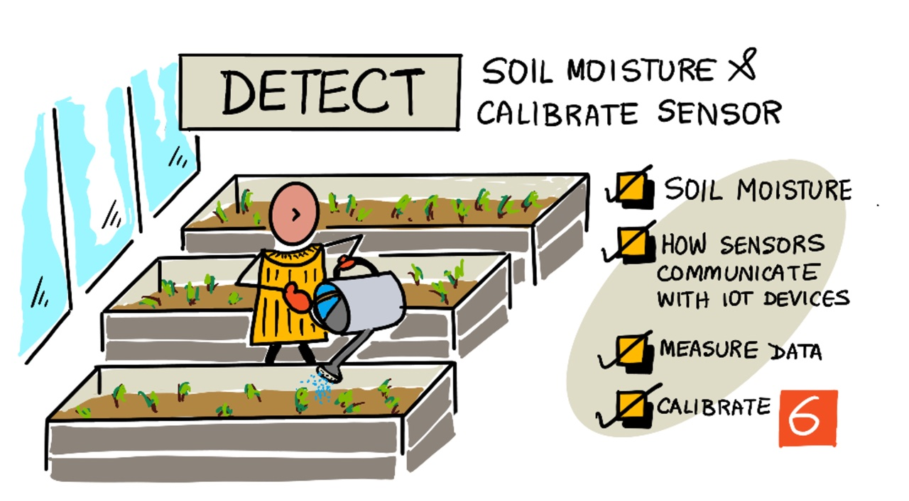
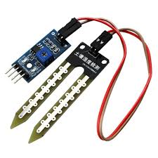
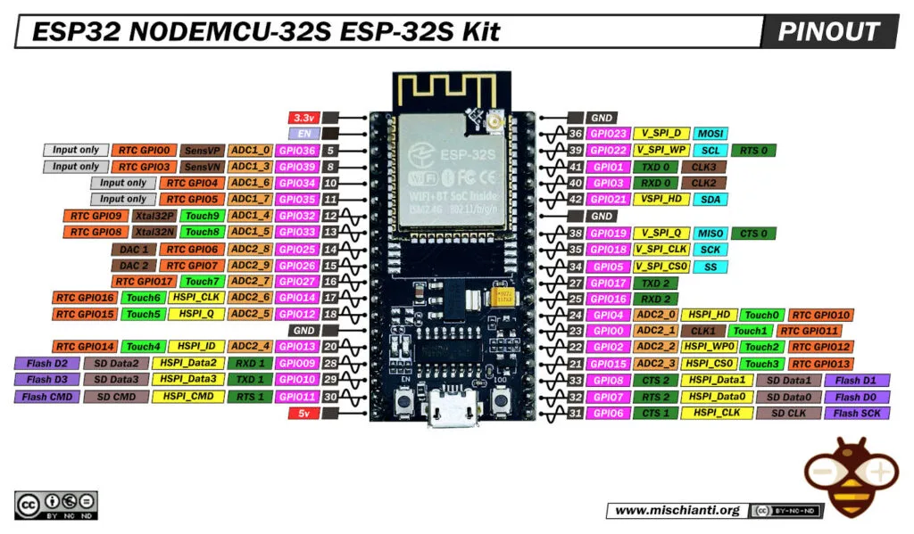
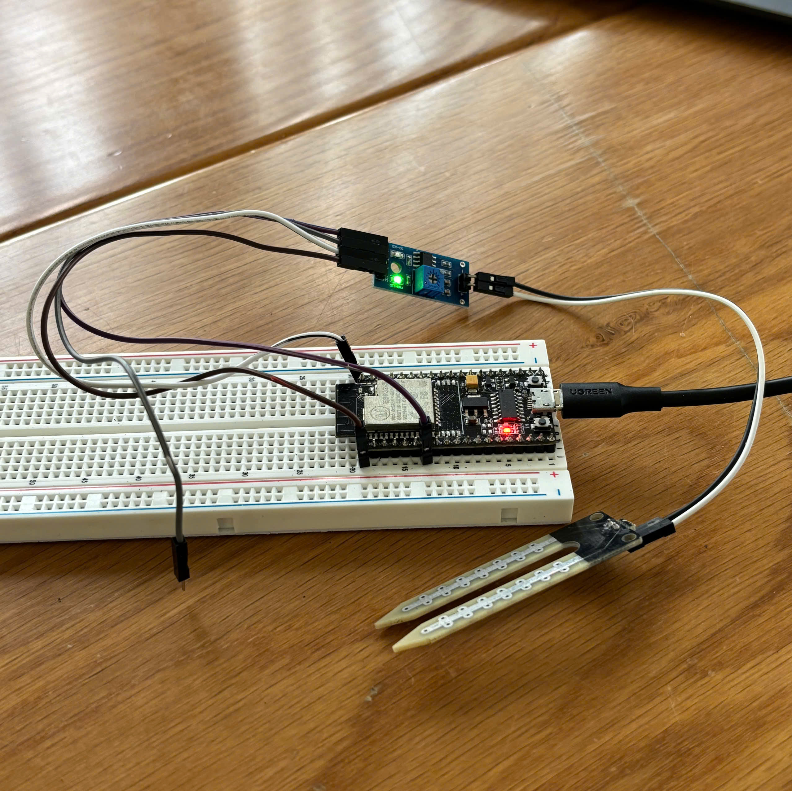
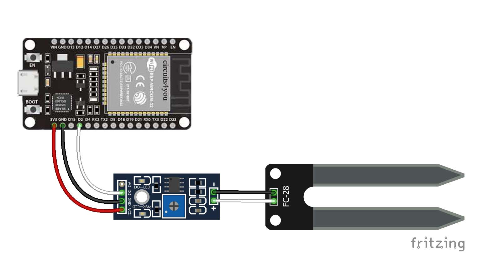
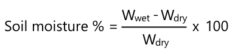
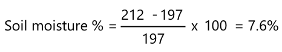

<div class="absolute inset-0 bg-gradient-to-br from-[#0a2e1a] via-[#0d3d1f] to-[#071a10]" />

<div class="relative z-10 flex flex-col h-full justify-center pl-16">

<div class="text-[#4ade80] text-sm font-mono tracking-widest uppercase mb-4">IoT for Beginners · Lesson 6</div>

# <span class="text-white font-bold leading-tight">Soil Moisture</span><br><span class="text-[#4ade80]">Detection</span>

<div class="mt-4 text-gray-300 text-lg max-w-lg">
From raw voltage readings to calibrated soil data —<br>
sensors, protocols & machine learning on ESP32.
</div>

<div class="mt-8 flex gap-3 text-sm text-gray-400">
  <span class="bg-[#1a4d2a] px-3 py-1 rounded-full border border-[#2d7a40]">📡 MQTT & IoT Protocols</span>
  <span class="bg-[#1a4d2a] px-3 py-1 rounded-full border border-[#2d7a40]">🌱 Soil Science</span>
  <span class="bg-[#1a4d2a] px-3 py-1 rounded-full border border-[#2d7a40]">🔌 ESP32</span>
</div>

</div>



<!--
Welcome. Today we bridge the gap between raw sensor data and real-world meaning.
We'll look at protocols, sensors, and how to build a calibrated soil moisture pipeline on ESP32.
-->

---
layout: center
class: text-center
---

<div class="absolute inset-0 bg-[#071810]" />

<div class="relative z-10">

## Part I

# <span class="text-[#4ade80]">MQTT & IoT Protocols</span>

<div class="text-gray-400 mt-3">How IoT devices talk to each other — and to the cloud</div>

</div>

---

<div class="absolute inset-0 bg-[#08200f]" />

<div class="relative z-10 h-full flex flex-col justify-center px-12">

<h2 class="text-[#4ade80] text-sm font-mono uppercase tracking-widest mb-2">MQTT Overview</h2>
<h1 class="text-white text-3xl font-bold mb-8">The Lightweight Messaging Protocol</h1>

<div class="grid grid-cols-2 gap-8">

<div class="space-y-5">

<div class="flex gap-4 items-start">
  <div class="w-10 h-10 rounded-full bg-[#14532d] flex items-center justify-center text-[#4ade80] font-bold flex-shrink-0">P</div>
  <div>
    <div class="text-white font-semibold">Publish / Subscribe</div>
    <div class="text-gray-400 text-sm mt-1">Devices publish to <span class="text-[#4ade80] font-mono">topics</span>; subscribers receive. No direct device-to-device coupling.</div>
  </div>
</div>

<div class="flex gap-4 items-start">
  <div class="w-10 h-10 rounded-full bg-[#14532d] flex items-center justify-center text-[#4ade80] font-bold flex-shrink-0">B</div>
  <div>
    <div class="text-white font-semibold">Broker Architecture</div>
    <div class="text-gray-400 text-sm mt-1">A central <span class="text-[#4ade80]">broker</span> (e.g. Eclipse Mosquitto) routes all messages between publishers and subscribers.</div>
  </div>
</div>

<div class="flex gap-4 items-start">
  <div class="w-10 h-10 rounded-full bg-[#14532d] flex items-center justify-center text-[#4ade80] font-bold flex-shrink-0">Q</div>
  <div>
    <div class="text-white font-semibold">Quality of Service (QoS)</div>
    <div class="text-gray-400 text-sm mt-1">QoS 0 (at most once), QoS 1 (at least once), QoS 2 (exactly once).</div>
  </div>
</div>

</div>

<div class="bg-[#0d2b17] rounded-xl p-5 border border-[#1a4d2a]">

```
ESP32 (Sensor Node)
   │
   │ publish("farm/soil/moisture", 512)
   ▼
[MQTT Broker]
   │
   │ subscribe("farm/soil/#")
   ▼
Cloud Dashboard / Server
```

<div class="mt-3 text-xs text-gray-500">Typical IoT soil monitoring topology</div>

</div>

</div>

</div>

<!--
MQTT is the backbone of most IoT systems.
Its pub/sub model means sensors don't need to know who's listening — perfect for scale.
-->

---

<div class="absolute inset-0 bg-[#08200f]" />

<div class="relative z-10 h-full flex flex-col justify-center px-12">

<h2 class="text-[#4ade80] text-sm font-mono uppercase tracking-widest mb-2">IoT Protocol Landscape</h2>
<h1 class="text-white text-3xl font-bold mb-8">Choosing the Right Protocol</h1>

<div class="grid grid-cols-3 gap-4">

<div class="bg-[#0d2b17] border border-[#1a4d2a] rounded-xl p-5 hover:border-[#4ade80] transition-colors">
  <div class="text-[#4ade80] text-2xl mb-2">📡</div>
  <div class="text-white font-bold text-lg">MQTT</div>
  <div class="text-gray-400 text-sm mt-2">Low bandwidth, pub/sub over TCP. Ideal for constrained devices & cloud telemetry.</div>
  <div class="mt-3 text-xs font-mono text-[#4ade80]">Port 1883 / 8883 (TLS)</div>
</div>

<div class="bg-[#0d2b17] border border-[#1a4d2a] rounded-xl p-5 hover:border-[#4ade80] transition-colors">
  <div class="text-[#4ade80] text-2xl mb-2">🌐</div>
  <div class="text-white font-bold text-lg">HTTP / REST</div>
  <div class="text-gray-400 text-sm mt-2">Familiar request/response. Higher overhead, better for configuration & dashboards.</div>
  <div class="mt-3 text-xs font-mono text-[#4ade80]">Port 80 / 443</div>
</div>

<div class="bg-[#0d2b17] border border-[#1a4d2a] rounded-xl p-5 hover:border-[#4ade80] transition-colors">
  <div class="text-[#4ade80] text-2xl mb-2">📶</div>
  <div class="text-white font-bold text-lg">LoRaWAN</div>
  <div class="text-gray-400 text-sm mt-2">Long-range, ultra-low power. Used in field-deployed sensors kilometres from a hub.</div>
  <div class="mt-3 text-xs font-mono text-[#4ade80]">868 / 915 MHz</div>
</div>

</div>

<div class="mt-6 grid grid-cols-2 gap-4">

<div class="bg-[#0d2b17] border border-[#1a4d2a] rounded-xl p-4 flex gap-4 items-center">
  <div class="text-2xl">🔵</div>
  <div>
    <div class="text-white font-bold">Bluetooth LE</div>
    <div class="text-gray-400 text-sm">Short range, ideal for wearables & nearby sensors. Used with phone-based gateways.</div>
  </div>
</div>

<div class="bg-[#0d2b17] border border-[#1a4d2a] rounded-xl p-4 flex gap-4 items-center">
  <div class="text-2xl">🕸️</div>
  <div>
    <div class="text-white font-bold">Zigbee / Z-Wave</div>
    <div class="text-gray-400 text-sm">Mesh networking. Each node relays data, great for building-scale deployments.</div>
  </div>
</div>

</div>

</div>

---
layout: center
class: text-center
---

<div class="absolute inset-0 bg-[#071810]" />

<div class="relative z-10">

## Part II

# <span class="text-[#4ade80]">Our Project</span>

<div class="text-gray-400 mt-3">Soil moisture detection at VGU</div>

</div>

---

<div class="absolute inset-0 bg-[#08200f]" />

<div class="relative z-10 h-full flex flex-col justify-center px-12">

<h2 class="text-[#4ade80] text-sm font-mono uppercase tracking-widest mb-2">Project Introduction</h2>
<h1 class="text-white text-3xl font-bold mb-6">Automated Soil Moisture Monitoring at VGU</h1>

<div class="grid grid-cols-2 gap-8 items-center">

<div class="space-y-4">
  <p class="text-gray-300 text-base leading-relaxed">
    Plants need water to survive — but <span class="text-[#4ade80] font-semibold">too little</span> starves roots, and <span class="text-[#4ade80] font-semibold">too much</span> suffocates them. Manual watering is unreliable and wasteful.
  </p>
  <p class="text-gray-300 text-base leading-relaxed">
    Our project deploys ESP32-based <span class="text-[#4ade80] font-semibold">soil moisture sensors</span> across VGU campus to measure, calibrate, and infer real soil water content — enabling intelligent, data-driven watering decisions.
  </p>
  <div class="flex gap-3 mt-4 flex-wrap">
    <span class="bg-[#14532d] text-[#4ade80] px-3 py-1 rounded-full text-sm border border-[#2d7a40]">🌱 Capacitive Sensor</span>
    <span class="bg-[#14532d] text-[#4ade80] px-3 py-1 rounded-full text-sm border border-[#2d7a40]">🔌 ESP32</span>
    <span class="bg-[#14532d] text-[#4ade80] px-3 py-1 rounded-full text-sm border border-[#2d7a40]">📊 Linear Regression</span>
    <span class="bg-[#14532d] text-[#4ade80] px-3 py-1 rounded-full text-sm border border-[#2d7a40]">📡 MQTT</span>
  </div>
</div>

<div class="rounded-2xl overflow-hidden border border-[#1a4d2a] bg-[#0d2b17] flex items-center justify-center h-60">
  <!-- watering-vgu.png: replace src below when file is available -->
  <div class="text-center text-gray-500">
    <div class="text-5xl mb-3">🌿</div>
    <div class="text-sm font-mono">watering-vgu.png</div>
    <div class="text-xs mt-1 text-gray-600">VGU campus watering system</div>
  </div>
</div>

</div>

</div>

<!--
This is the "why" slide.
IoT devices remove guesswork from irrigation — precision agriculture at campus scale.
-->

---
layout: center
class: text-center
---

<div class="absolute inset-0 bg-[#071810]" />

<div class="relative z-10">

## Part III

# <span class="text-[#4ade80]">Sensor Communication</span>

<div class="text-gray-400 mt-3">How sensors talk to IoT devices: GPIO, Analog, I²C, SPI, Wireless</div>

</div>

---

<div class="absolute inset-0 bg-[#08200f]" />

<div class="relative z-10 h-full flex flex-col justify-center px-12">

<h2 class="text-[#4ade80] text-sm font-mono uppercase tracking-widest mb-2">Sensor Protocols</h2>
<h1 class="text-white text-3xl font-bold mb-6">How Sensors Communicate with IoT Devices</h1>

<div class="grid grid-cols-3 gap-4">

<div class="bg-[#0d2b17] border border-[#1a4d2a] rounded-xl p-4">
  <div class="text-[#4ade80] font-mono font-bold text-base mb-2">GPIO</div>
  <div class="text-gray-300 text-sm">General Purpose I/O pins. Digital only — HIGH or LOW. Used for buttons, LEDs, and simple on/off sensors.</div>
  <div class="mt-2 text-xs text-gray-500">3.3V or 5V · Binary signal</div>
</div>

<div class="bg-[#0d2b17] border border-[#1a4d2a] rounded-xl p-4">
  <div class="text-[#4ade80] font-mono font-bold text-base mb-2">Analog Pin (ADC)</div>
  <div class="text-gray-300 text-sm">Converts a voltage range into a 10-bit number (0–1023). <span class="text-[#4ade80]">Our soil moisture sensor uses this.</span></div>
  <div class="mt-2 text-xs text-gray-500">0–3.3V → 0–1023</div>
</div>

<div class="bg-[#0d2b17] border border-[#1a4d2a] rounded-xl p-4">
  <div class="text-[#4ade80] font-mono font-bold text-base mb-2">I²C</div>
  <div class="text-gray-300 text-sm">Multi-device bus using 2 wires (SDA + SCL). Each device has a unique address. Up to 400 Kbps.</div>
  <div class="mt-2 text-xs text-gray-500">Addressed packets · Clock-synced</div>
</div>

<div class="bg-[#0d2b17] border border-[#1a4d2a] rounded-xl p-4">
  <div class="text-[#4ade80] font-mono font-bold text-base mb-2">SPI</div>
  <div class="text-gray-300 text-sm">Full-duplex, high speed (multi-MB/s). Controller selects one peripheral at a time via Chip Select wire.</div>
  <div class="mt-2 text-xs text-gray-500">COPI · CIPO · SCLK · CS</div>
</div>

<div class="bg-[#0d2b17] border border-[#1a4d2a] rounded-xl p-4">
  <div class="text-[#4ade80] font-mono font-bold text-base mb-2">UART</div>
  <div class="text-gray-300 text-sm">Two-wire serial: Tx → Rx. Async communication with defined baud rate (e.g. 9600 bps). Common for GPS.</div>
  <div class="mt-2 text-xs text-gray-500">Start bit · 8 data bits · Stop bit</div>
</div>

<div class="bg-[#0d2b17] border border-[#1a4d2a] rounded-xl p-4">
  <div class="text-[#4ade80] font-mono font-bold text-base mb-2">Wireless</div>
  <div class="text-gray-300 text-sm">BLE, WiFi, LoRaWAN, Zigbee. Enables remote sensing without physical cable runs.</div>
  <div class="mt-2 text-xs text-gray-500">LoRaWAN: km-range, µW power</div>
</div>

</div>

</div>

---

<div class="absolute inset-0 bg-[#08200f]" />

<div class="relative z-10 h-full flex flex-col justify-center px-12">

<h2 class="text-[#4ade80] text-sm font-mono uppercase tracking-widest mb-2">Moisture Sensor Deep-Dive</h2>
<h1 class="text-white text-3xl font-bold mb-6">Capacitive vs Resistive Soil Moisture Sensors</h1>

<div class="grid grid-cols-2 gap-8">

<div class="space-y-5">

<div class="bg-[#0d2b17] border border-[#1a4d2a] rounded-xl p-5">
  <div class="text-[#4ade80] font-bold text-lg mb-2">⚡ Resistive Sensor</div>
  <div class="text-gray-300 text-sm leading-relaxed">Two metal probes in soil. Measures how much current passes between them. Water conducts electricity — <span class="text-white">wetter soil = lower resistance</span>.</div>
  <div class="mt-2 text-xs text-red-400">⚠ Corrodes over time due to electrolysis</div>
</div>

<div class="bg-[#0d2b17] border border-[#2d7a40] rounded-xl p-5 ring-1 ring-[#4ade80]">
  <div class="text-[#4ade80] font-bold text-lg mb-2">🌊 Capacitive Sensor <span class="text-xs bg-[#14532d] px-2 py-0.5 rounded-full ml-1">Our Choice</span></div>
  <div class="text-gray-300 text-sm leading-relaxed">Measures electric charge storage across two plates. Wetter soil → lower output voltage. Analog output: 0–3.3V → read as 0–1023 by ADC.</div>
  <div class="mt-2 text-xs text-[#4ade80]">✓ No corrosion · Long lifespan · Stable readings</div>
</div>

</div>

<div class="flex flex-col gap-4">
  
  <div class="bg-[#0d2b17] rounded-xl p-4 border border-[#1a4d2a] text-sm text-gray-300">
    <div class="text-white font-semibold mb-1">FC-28 Capacitive Sensor</div>
    Outputs an analog voltage. Read via ESP32 ADC pin. Raw value: <span class="text-[#4ade80] font-mono">0–1023</span> → must be calibrated to get actual <span class="text-[#4ade80]">%</span> moisture.
  </div>
</div>

</div>

</div>

---
layout: center
class: text-center
---

<div class="absolute inset-0 bg-[#071810]" />

<div class="relative z-10">

## Part IV

# <span class="text-[#4ade80]">The Soil Moisture Problem</span>

<div class="text-gray-400 mt-3">Hardware → Data Collection → Calibration → Inference</div>

</div>

---

<div class="absolute inset-0 bg-[#08200f]" />

<div class="relative z-10 h-full flex flex-col justify-center px-12">

<h2 class="text-[#4ade80] text-sm font-mono uppercase tracking-widest mb-2">Step 1 — Hardware</h2>
<h1 class="text-white text-3xl font-bold mb-6">Our Devices</h1>

<div class="grid grid-cols-2 gap-8 items-start">

<div class="space-y-4">

<div class="flex gap-4 items-center bg-[#0d2b17] border border-[#1a4d2a] rounded-xl p-4">
  
  <div>
    <div class="text-white font-bold">ESP32 NodeMCU-32S</div>
    <div class="text-gray-400 text-sm">Main microcontroller. Dual-core 240 MHz, built-in WiFi & BLE. Reads sensor via ADC pin.</div>
  </div>
</div>

<div class="flex gap-4 items-center bg-[#0d2b17] border border-[#1a4d2a] rounded-xl p-4">
  
  <div>
    <div class="text-white font-bold">FC-28 Moisture Sensor</div>
    <div class="text-gray-400 text-sm">Capacitive type. Analog voltage output. Plugs into ESP32 ADC pin directly.</div>
  </div>
</div>

<div class="flex gap-4 items-center bg-[#0d2b17] border border-[#1a4d2a] rounded-xl p-4">
  <div class="text-3xl w-16 text-center">🔋</div>
  <div>
    <div class="text-white font-bold">Power Supply</div>
    <div class="text-gray-400 text-sm">USB-powered via laptop or power bank during field measurements.</div>
  </div>
</div>

</div>

<div class="space-y-4">
  
  
</div>

</div>

</div>

---

<div class="absolute inset-0 bg-[#08200f]" />

<div class="relative z-10 h-full flex flex-col justify-center px-12">

<h2 class="text-[#4ade80] text-sm font-mono uppercase tracking-widest mb-2">Step 2 — Data Collection</h2>
<h1 class="text-white text-3xl font-bold mb-6">Sampling & Calibration</h1>

<div class="grid grid-cols-2 gap-8">

<div class="space-y-4">

<div class="text-gray-300 text-sm leading-relaxed">
  Raw sensor readings (0–1023) are meaningless without calibration. We follow the <span class="text-[#4ade80] font-semibold">gravimetric method</span>:
</div>

<div class="space-y-3">
  <div class="flex gap-3 items-start">
    <div class="w-6 h-6 rounded-full bg-[#4ade80] text-black text-xs font-bold flex items-center justify-center flex-shrink-0 mt-0.5">1</div>
    <div class="text-gray-300 text-sm">Insert sensor → record raw ADC reading</div>
  </div>
  <div class="flex gap-3 items-start">
    <div class="w-6 h-6 rounded-full bg-[#4ade80] text-black text-xs font-bold flex items-center justify-center flex-shrink-0 mt-0.5">2</div>
    <div class="text-gray-300 text-sm">Take soil sample → weigh it (W<sub>wet</sub>)</div>
  </div>
  <div class="flex gap-3 items-start">
    <div class="w-6 h-6 rounded-full bg-[#4ade80] text-black text-xs font-bold flex items-center justify-center flex-shrink-0 mt-0.5">3</div>
    <div class="text-gray-300 text-sm">Dry soil at 110°C for several hours → weigh again (W<sub>dry</sub>)</div>
  </div>
  <div class="flex gap-3 items-start">
    <div class="w-6 h-6 rounded-full bg-[#4ade80] text-black text-xs font-bold flex items-center justify-center flex-shrink-0 mt-0.5">4</div>
    <div class="text-gray-300 text-sm">Calculate soil moisture %, repeat ≥ 3 samples</div>
  </div>
</div>

<div class="bg-[#0d2b17] border border-[#1a4d2a] rounded-xl p-4">
  <div class="text-[#4ade80] font-mono text-sm mb-2">Gravimetric Soil Moisture</div>
  
</div>

</div>

<div class="space-y-4">
  <!-- sampling-ground.png placeholder -->
  <div class="bg-[#0d2b17] border border-[#1a4d2a] rounded-xl p-4 flex flex-col items-center justify-center h-36 text-gray-500">
    <div class="text-3xl mb-2">🗺️</div>
    <div class="text-xs font-mono">sampling-ground.png</div>
    <div class="text-xs text-gray-600 mt-1">VGU campus sampling locations</div>
  </div>
  <!-- raw-moisture-measure-sample.png placeholder -->
  <div class="bg-[#0d2b17] border border-[#1a4d2a] rounded-xl p-4 flex flex-col items-center justify-center h-36 text-gray-500">
    <div class="text-3xl mb-2">📸</div>
    <div class="text-xs font-mono">raw-moisture-measure-sample.png</div>
    <div class="text-xs text-gray-600 mt-1">Field measurement in progress</div>
  </div>
</div>

</div>

</div>

---

<div class="absolute inset-0 bg-[#08200f]" />

<div class="relative z-10 h-full flex flex-col justify-center px-12">

<h2 class="text-[#4ade80] text-sm font-mono uppercase tracking-widest mb-2">Step 2 — Calibration Example</h2>
<h1 class="text-white text-3xl font-bold mb-6">Gravimetric Soil Moisture — Worked Example</h1>

<div class="grid grid-cols-2 gap-10 items-center">

<div class="space-y-5">

<div class="bg-[#0d2b17] border border-[#1a4d2a] rounded-xl p-5">
  <div class="text-[#4ade80] font-semibold mb-3">Given sample:</div>
  <div class="space-y-2 text-sm text-gray-300">
    <div class="flex justify-between"><span>W<sub>wet</sub></span><span class="font-mono text-white">212 g</span></div>
    <div class="flex justify-between"><span>W<sub>dry</sub></span><span class="font-mono text-white">197 g</span></div>
    <div class="border-t border-[#1a4d2a] my-2"></div>
    <div class="flex justify-between"><span>W<sub>wet</sub> − W<sub>dry</sub></span><span class="font-mono text-white">15 g</span></div>
    <div class="flex justify-between"><span>÷ W<sub>dry</sub></span><span class="font-mono text-white">0.076</span></div>
    <div class="flex justify-between"><span>× 100</span><span class="font-mono text-[#4ade80] font-bold">7.6 %</span></div>
  </div>
</div>

<div class="text-gray-400 text-sm leading-relaxed">
  Repeat for ≥ 3 soil samples at different wetness levels. Plot <span class="text-[#4ade80]">sensor voltage</span> vs <span class="text-[#4ade80]">moisture %</span> to build the calibration curve.
</div>

</div>

<div class="space-y-4">
  
</div>

</div>

</div>

---

<div class="absolute inset-0 bg-[#08200f]" />

<div class="relative z-10 h-full flex flex-col justify-center px-12">

<h2 class="text-[#4ade80] text-sm font-mono uppercase tracking-widest mb-2">Step 2 — Linear Regression</h2>
<h1 class="text-white text-3xl font-bold mb-6">Fitting the Calibration Curve</h1>

<div class="grid grid-cols-2 gap-8 items-center">

<div class="space-y-5">

<div class="text-gray-300 text-sm leading-relaxed">
  Once we have ≥ 3 data points (sensor reading → actual moisture %), we fit a <span class="text-[#4ade80] font-semibold">linear regression</span> line:
</div>

<div class="bg-[#0d2b17] border border-[#1a4d2a] rounded-xl p-4 font-mono text-sm">
  <div class="text-[#4ade80]">moisture_% = m × voltage + b</div>
  <div class="text-gray-500 text-xs mt-1">where m and b are learned from samples</div>
</div>

<div class="space-y-3 text-sm text-gray-300">
  <div class="flex gap-3 items-start">
    <div class="text-[#4ade80] font-bold">→</div>
    <div>For <span class="text-white">capacitive sensors</span>: higher voltage = drier soil (inverse relationship)</div>
  </div>
  <div class="flex gap-3 items-start">
    <div class="text-[#4ade80] font-bold">→</div>
    <div>For <span class="text-white">resistive sensors</span>: higher voltage = wetter soil (direct relationship)</div>
  </div>
  <div class="flex gap-3 items-start">
    <div class="text-[#4ade80] font-bold">→</div>
    <div>The line lets us convert any new sensor reading to moisture % in real time</div>
  </div>
</div>

</div>

<!-- regression.png placeholder -->
<div class="bg-[#0d2b17] border border-[#1a4d2a] rounded-xl flex flex-col items-center justify-center h-64 text-gray-500">
  <div class="text-4xl mb-3">📈</div>
  <div class="text-sm font-mono">regression.png</div>
  <div class="text-xs text-gray-600 mt-1">Voltage vs. Moisture % with best-fit line</div>
</div>

</div>

</div>

---

<div class="absolute inset-0 bg-[#08200f]" />

<div class="relative z-10 h-full flex flex-col justify-center px-12">

<h2 class="text-[#4ade80] text-sm font-mono uppercase tracking-widest mb-2">Step 3 — ESP32 Code</h2>
<h1 class="text-white text-3xl font-bold mb-5">IoT Code for Soil Moisture Reading</h1>

<div class="grid grid-cols-2 gap-8">

<div class="bg-[#071810] rounded-xl border border-[#1a4d2a] p-5 font-mono text-sm overflow-hidden">

```cpp
// ESP32 Soil Moisture Reader
#include <Arduino.h>

const int SENSOR_PIN = 34; // ADC1_CH6
const int NUM_SAMPLES = 10;

// Calibration coefficients (from regression)
// moisture_% = SLOPE * raw + INTERCEPT
const float SLOPE = -0.062f;
const float INTERCEPT = 73.4f;

float readMoisturePercent() {
  long sum = 0;
  for (int i = 0; i < NUM_SAMPLES; i++) {
    sum += analogRead(SENSOR_PIN);
    delay(10);
  }
  float raw = sum / (float)NUM_SAMPLES;
  float voltage = raw * (3.3f / 4095.0f);
  return SLOPE * voltage + INTERCEPT;
}

void loop() {
  float moisture = readMoisturePercent();
  Serial.printf("Moisture: %.1f%%\n", moisture);
  delay(1000);
}
```

</div>

<div class="space-y-4">

<div class="bg-[#0d2b17] border border-[#1a4d2a] rounded-xl p-4">
  <div class="text-[#4ade80] font-semibold mb-2">Key implementation details</div>
  <ul class="text-gray-300 text-sm space-y-2">
    <li>• ADC pin 34 — 12-bit resolution (0–4095) on ESP32</li>
    <li>• 10-sample average reduces electrical noise</li>
    <li>• Linear model applied after averaging</li>
    <li>• Publishes to MQTT topic via WiFi</li>
  </ul>
</div>

<div class="bg-[#0d2b17] border border-[#1a4d2a] rounded-xl p-4">
  <div class="text-[#4ade80] font-semibold mb-2">MQTT publish snippet</div>
  <div class="font-mono text-xs text-gray-300">
    <div><span class="text-[#4ade80]">client</span>.publish(</div>
    <div class="pl-4"><span class="text-yellow-400">"vgu/soil/moisture"</span>,</div>
    <div class="pl-4">String(moisture).c_str()</div>
    <div>);</div>
  </div>
</div>

</div>

</div>

</div>

---

<div class="absolute inset-0 bg-[#08200f]" />

<div class="relative z-10 h-full flex flex-col justify-center px-12">

<h2 class="text-[#4ade80] text-sm font-mono uppercase tracking-widest mb-2">Step 4 — Inference Pipeline</h2>
<h1 class="text-white text-3xl font-bold mb-6">From Raw Reading to Actionable Moisture Data</h1>

<div class="grid grid-cols-2 gap-8 items-center">

<div class="space-y-5">

<div class="text-gray-300 text-sm leading-relaxed">
  A single reading can be noisy. We apply a <span class="text-[#4ade80] font-semibold">moving average</span> over multiple measurements taken at different times to smooth out noise and capture true soil state.
</div>

<div class="bg-[#0d2b17] border border-[#1a4d2a] rounded-xl p-4 font-mono text-sm space-y-1">
  <div class="text-gray-500 text-xs mb-2">// Moving average window</div>
  <div><span class="text-blue-400">const</span> <span class="text-white">WINDOW_SIZE</span> = <span class="text-[#4ade80]">5</span>;</div>
  <div><span class="text-blue-400">float</span> readings[WINDOW_SIZE];</div>
  <div class="mt-2 text-gray-500 text-xs">// Average before applying model</div>
  <div><span class="text-blue-400">float</span> avg = mean(readings);</div>
  <div><span class="text-blue-400">float</span> moisture = model(avg);</div>
</div>

<div class="space-y-2 text-sm text-gray-300">
  <div class="flex gap-3"><span class="text-[#4ade80]">⏱</span><span>Readings taken every 30 min — captures diurnal variation</span></div>
  <div class="flex gap-3"><span class="text-[#4ade80]">📊</span><span>Moving average over last 5 readings smooths noise</span></div>
  <div class="flex gap-3"><span class="text-[#4ade80]">🚨</span><span>Alert if moisture drops below threshold → trigger watering</span></div>
</div>

</div>

<!-- pipeline.png placeholder -->
<div class="bg-[#0d2b17] border border-[#1a4d2a] rounded-xl flex flex-col items-center justify-center h-72 text-gray-500">
  <div class="text-4xl mb-3">🔄</div>
  <div class="text-sm font-mono">pipeline.png</div>
  <div class="text-xs text-gray-600 mt-1">End-to-end inference pipeline diagram</div>
</div>

</div>

</div>

---

<div class="absolute inset-0 bg-gradient-to-br from-[#0a2e1a] via-[#0d3d1f] to-[#071a10]" />

<div class="relative z-10 h-full flex flex-col justify-center items-center text-center px-12">

<div class="text-[#4ade80] text-sm font-mono uppercase tracking-widest mb-4">Summary</div>

<h1 class="text-white text-4xl font-bold mb-8">What We Built</h1>

<div class="grid grid-cols-4 gap-5 w-full max-w-4xl">

<div class="bg-[#0d2b17] border border-[#1a4d2a] rounded-2xl p-5">
  <div class="text-3xl mb-3">📡</div>
  <div class="text-white font-bold mb-1">MQTT Protocol</div>
  <div class="text-gray-400 text-xs">Pub/sub messaging between ESP32 and cloud dashboard</div>
</div>

<div class="bg-[#0d2b17] border border-[#1a4d2a] rounded-2xl p-5">
  <div class="text-3xl mb-3">🔌</div>
  <div class="text-white font-bold mb-1">Sensor Wiring</div>
  <div class="text-gray-400 text-xs">GPIO, ADC, I²C, SPI — matched to sensor type</div>
</div>

<div class="bg-[#0d2b17] border border-[#1a4d2a] rounded-2xl p-5">
  <div class="text-3xl mb-3">📊</div>
  <div class="text-white font-bold mb-1">Calibration</div>
  <div class="text-gray-400 text-xs">Gravimetric sampling → linear regression model</div>
</div>

<div class="bg-[#0d2b17] border border-[#1a4d2a] rounded-2xl p-5">
  <div class="text-3xl mb-3">🔄</div>
  <div class="text-white font-bold mb-1">Live Inference</div>
  <div class="text-gray-400 text-xs">Moving average + model → actionable moisture %</div>
</div>

</div>

<div class="mt-10 text-gray-500 text-sm">
  Microsoft IoT for Beginners · Farm Project · Lesson 6 — Detect Soil Moisture
</div>

</div>

<!--
We've covered the full stack: protocol, hardware, calibration, and inference.
The same pipeline scales from a single plant to an entire farm.
-->